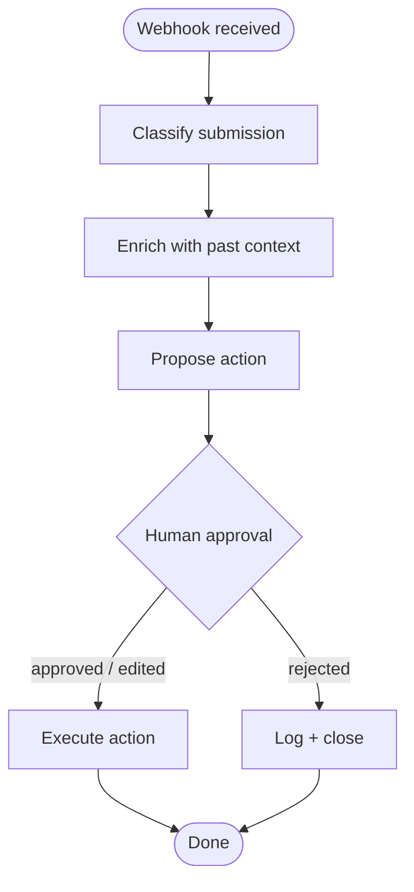

# WitUS Triage Agent

A LangGraph agent that reads incoming **WitUS Inbox** submissions, classifies them,
enriches them with context, proposes an action, and **waits for a human to approve**
before doing anything irreversible.

[](LICENSE)
[](https://nodejs.org)
[](https://www.typescriptlang.org)
[](https://smith.langchain.com)

```
classify → enrich → propose → human approval → execute | log rejection
```

---

## TL;DR

WitUS Inbox collects form submissions from across a small ecosystem of products into one
table. Reading every webhook by hand does not scale. This repo is the LangGraph agent
that triages that traffic: typed graph state, schema-validated tools, and a
human-in-the-loop interrupt that **pauses the graph** until an operator approves. It is
production code with a real database, real auth, and real failure handling — not a demo.

It also runs on **two LLM providers from one codebase** — Gemini 2.5 Flash for
development and CI, Claude Sonnet 4.6 for production. The provider is selected by
environment, and an admin dashboard at `/admin` picks the model **per graph node**, so
the same agent can be tested cheaply and tuned without a redeploy.

A 4-lesson curriculum under [`docs/lessons/`](docs/lessons/README.md) teaches the
patterns this repo demonstrates.

---

## The problem

WitUS Inbox is a small internal tool that ingests signed webhooks from every product in
the WitUS ecosystem — CentenarianOS, FlashLearnAI, Wanderlearn, Fly.WitUS, Work.WitUS,
Tour Manager OS, witus.online — and lands them in one canonical `submission` table.

Without an agent, every submission — the obvious ones included — costs human attention.
Most are resolvable in two clicks; a few are urgent; the rest are pattern-matchable
noise. This agent sits between the webhook and the human. It does the read-and-propose.
The human keeps the decision.

---

## Architecture



Six nodes. One durable approval interrupt. Five tools. One typed `TriageState` object
that carries everything between steps. The graph is one small, readable file:
[`agent/graph.ts`](agent/graph.ts).

---

## The three patterns

This repo demonstrates three LangGraph patterns; each has a companion lesson.

### 1. Typed graph state

Every node reads and writes one `TriageState` object — the contract between nodes. Each
field is owned by exactly one producing node and is optional until that node runs.

```ts
export const TriageStateAnnotation = Annotation.Root({
  rawSubmission: Annotation<RawSubmission>,
  classification: Annotation<Classification | undefined>,
  enrichment: Annotation<Enrichment | undefined>,
  proposedAction: Annotation<ProposedAction | undefined>,
  approval: Annotation<Approval | undefined>,
  execution: Annotation<Execution | undefined>,
});
```

Full state: [`agent/state.ts`](agent/state.ts) · Schemas: [`agent/schemas.ts`](agent/schemas.ts)

### 2. Schema-validated tools

Each of the five tools is a `tool()` wrapper with a Zod input schema — the same schema
documents the inputs, validates them, and (when bound to a model) becomes the JSON schema
the model sees.

```ts
export const searchPastSubmissions = tool(runSearchPastSubmissions, {
  name: "search_past_submissions",
  description: "Find prior WitUS Inbox submissions from the same contact email.",
  schema: SearchPastSubmissionsInputSchema,
});
```

All five tools: [`agent/tools/`](agent/tools/)

### 3. Human-in-the-loop interrupt

The graph pauses at `human_approval` via a real LangGraph `interrupt()`. A Postgres
checkpointer persists the paused run, so the pause survives across HTTP requests and
process restarts — the approval arrives on a *separate* request and resumes the exact
same graph thread with `new Command({ resume })`. Execution is unreachable except through
an approval. This is the pattern most agent demos skip and production systems need.

Nodes: [`agent/nodes/`](agent/nodes/) · Checkpointer: [`agent/checkpointer.ts`](agent/checkpointer.ts)

---

## Quick start

You need **Node 20+** and a **Postgres 16** database (local, or Neon's free tier). This
repo owns its own database — it does not connect to the live WitUS Inbox DB.

```bash
# 1. Install
npm install

# 2. Create a database
createdb witus_triage_agent

# 3. Configure
cp .env.example .env.local
#    Minimum to run the graph:
#      STORAGE_DATABASE_URL=postgresql://localhost:5432/witus_triage_agent
#      STORAGE_DATABASE_URL_UNPOOLED=postgresql://localhost:5432/witus_triage_agent
#      GEMINI_API_KEY=...        (testing — or ANTHROPIC_API_KEY for production)

# 4. Create the tables
npm run db:migrate

# 5. Seed the 25 hand-labeled fixture submissions
npm run db:seed

# 6. Run
npm run dev          # http://localhost:3000
```

`npm test` exercises the graph end to end (skipping live-LLM tests when no key is set).
The PRD's target is clone-to-running in under 15 minutes — if it is slower for you, that
is a real bug worth an issue.

---

## For operators (no code required)

If you just need to *use* the dashboard — review the queue, approve or reject — start with
the **operator guide**, written in plain language with no setup steps:

- In the running app: **[`/help`](http://localhost:3000/help)** (linked from the menu and
  footer; reachable without signing in).
- As markdown: **[`docs/operator-guide/`](docs/operator-guide/README.md)** — getting
  started, the queue, reading a run, approving/rejecting, what the categories mean, and an
  FAQ.

The menu and ecosystem footer appear on every page; the menu is auth-aware (a minimal
header signed out, the full dashboard nav once you sign in) and collapses to a hamburger on
small screens.

---

## Tech stack

| Layer | Choice |
|---|---|
| Runtime | Node.js 20+, Next.js 16 (app router, root layout) |
| Language | TypeScript strict |
| Agent | `@langchain/langgraph` 1.x + `@langchain/langgraph-checkpoint-postgres` |
| LLM | `@langchain/google-genai` (Gemini 2.5 Flash — testing) · `@langchain/anthropic` (Claude Sonnet 4.6 — production) |
| Database | Postgres / Neon, via Drizzle ORM on `node-postgres` |
| Auth | NextAuth v4 (magic-link, single-operator) · deny + waitlist for non-operators |
| Observability | LangSmith — optional, fail-soft |
| UI | Tailwind v4, hand-rolled components in the WitUS Inbox identity |
| Testing | Vitest |

The LLM provider is auto-detected from the keys present, or forced with
`TRIAGE_LLM_PROVIDER`.

---

## Curriculum

A 4-lesson, code-along walkthrough — every snippet links to the file it came from:

1. [From a chain to a graph](docs/lessons/01-chain-to-graph.md)
2. [Designing agent state](docs/lessons/02-agent-state.md)
3. [Tools and the human-in-the-loop interrupt](docs/lessons/03-tools-and-approval.md)
4. [Observability: reading a trace](docs/lessons/04-observability.md)

---

## Project structure

```
agent/
  graph.ts          The LangGraph state machine (the whole graph, one file)
  state.ts          TriageState — the typed object that flows through it
  schemas.ts        Zod schemas; every payload type is z.infer of one
  checkpointer.ts   PostgresSaver — makes the interrupt durable
  model.ts          Dual-provider chat-model factory
  nodes/            classify · enrich · propose · humanApproval · execute · logRejection
  tools/            5 tools, each a tool() wrapper with a Zod schema
app/
  layout.tsx        root layout — shared menu + ecosystem footer on every page
  help/             public operator help (in-app onboarding guide)
  api/triage/       start (HMAC webhook) · runs · runs/[id] · approve · reject
  api/admin/        settings — per-node model configuration
  triage/           operator dashboard — queue, run detail, history, waitlist
  admin/            per-node LLM model picker
db/
  schema.ts         Drizzle schema — submission mirror, triage, app_settings,
                    waitlist, auth tables
  migrations/
lib/                env · auth · session · hmac · sms · langsmith · triage-runner ·
                    settings · waitlist · inbox-sender
docs/
  STYLEGUIDE.md     Code + style guide
  operator-guide/   Plain-language guide for non-developer operators
  lessons/          The 4-lesson curriculum
__tests__/          Vitest suites + 25 labeled fixtures
```

---

## Configuration

See [`.env.example`](.env.example) for the canonical list. Highlights:

```env
STORAGE_DATABASE_URL=             # Postgres (pooled)
STORAGE_DATABASE_URL_UNPOOLED=    # direct — migrations + checkpointer DDL
GEMINI_API_KEY=                   # testing LLM
ANTHROPIC_API_KEY=                # production LLM
LANGSMITH_API_KEY=                # optional — tracing is fail-soft
NEXTAUTH_SECRET=                  # operator dashboard
ADMIN_EMAIL=                      # the one operator allowed to sign in
TRIAGE_INGEST_SECRET=             # HMAC secret for the /api/triage/start webhook
```

LangSmith is on by default but the app runs fine with `LANGSMITH_API_KEY` unset —
failures are soft, a console warning rather than a crash.

---

## Testing

```bash
npm test          # full suite (live-LLM + DB tests skip without keys)
npm run eval      # classification accuracy on the 25-fixture set -> EVAL.md
```

`npm run eval` runs the classifier against all 25 hand-labeled fixtures and writes
[`EVAL.md`](EVAL.md). The PRD's acceptance bar is ≥ 80% accuracy; the current measured
result is **100% (25/25)** on Claude Sonnet 4.6. The eval is hardened — an infrastructure
failure (an exhausted quota, a bad key) aborts loudly instead of being scored as a wrong
answer, so the number is never a false negative.
[`__tests__/agent/graph.test.ts`](__tests__/agent/graph.test.ts) proves the approval
gate: the graph pauses with no execution, and only a resume produces one.

---

## A real bug, found in a trace

Early on, every classification came back `category: "other"`, `confidence: 0` — and the
runs did not error, so the test suite stayed green. The `classify` node is fail-soft: on
an LLM error it returns an `"other"` fallback so one bad input cannot crash the graph.
That safety net was silently catching *every* call.

The LangSmith trace made it obvious: the model-call span carried the real error —
*"Your credit balance is too low to access the Anthropic API."* Not a code bug; an
unfunded key. But the point stands: the failure was invisible to assertions on the output
and visible in the trace. [Lesson 4](docs/lessons/04-observability.md) walks through it.

---

## Why this exists

WitUS is a small ecosystem of products built under one idea: live long, work free. The
"work free" part stops being free when every product creates inbox load only one person
can answer. This agent is infrastructure that pays back the time it took to build.

It is also a portfolio piece. If you are wiring your first LangGraph and hit a wall on
state, tools, or the interrupt, the four lessons are how I would have wanted to learn it.

---

## License

MIT — see [LICENSE](LICENSE). Fork it, ship it, teach from it. Attribution appreciated,
not required.

Part of the WitUS ecosystem — © B4C LLC, an AwesomeWebStore.com brand.
